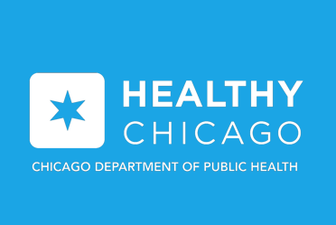
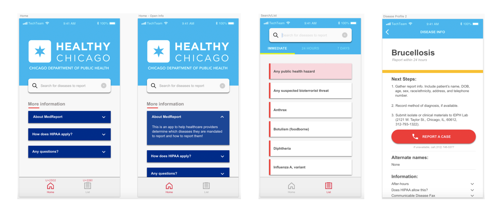

# CDPH Reporting App
> A Health Reporting App for the Chicago Department of Public Health (CDPH)

## Setup

`git clone https://github.com/JiaqiGao/cdph-react-native/`

Install packages.

`npm install`

Run the app in an iOS simulator with

`react-native run-ios`

If you get a bundle error, do
`react-native upgrade` and opt to keep your current .gitignore but replace the xproj

## Customize

Edit the app from the src folder, adding any necessary components and pages. Disease information powering the app is pulled from `src/assets/data.json`. Please maintain the structure of the json file when adding new diseases or removing previous ones.

---

## Contributors

This project was created through Institute of Politics <a href="https://www.uchicagotechteam.com/">Tech Team</a> at The University of Chicago for the Chicago Department of Public Health. Project management and technical development was led by Jiaqi Gao. User interface design was managed by Yena Kim.

